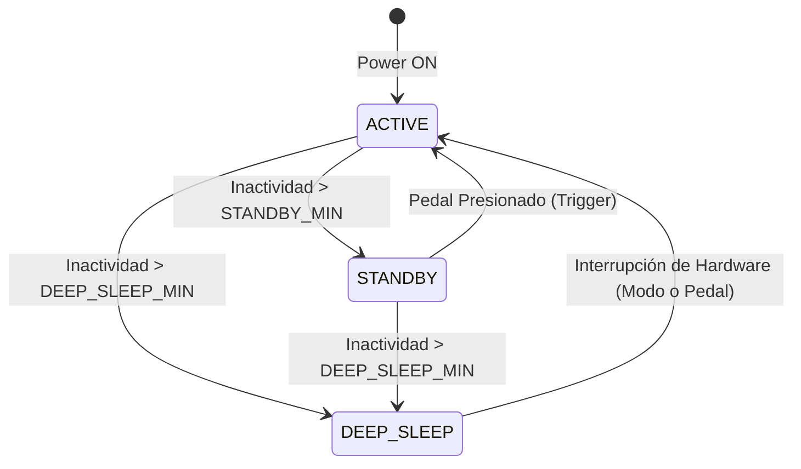

# Wireless Welder Pedal V1.1 - Architectural Optimization Report

Este reporte detalla la implementación oficial de la versión **V1.1**, desarrollada a partir de las exigencias técnicas del documento `DOCS/FIREWARE_OPTIMIZATION_PROMP.md`. Hemos evolucionado el firmware base (V1.0) hacia una arquitectura de alto rendimiento industrial, optimizando drásticamente el ancho de banda de radiofrecuencia (LoRa), la latencia de transmisión, el ciclo de vida de la FSM y el consumo energético en modo de reposo profundo.

Los archivos fuente han sido guardados como la nueva versión estable en:
- [transmitter_v1.1.ino](file:///Users/ARICF/Documents/PROYECTOS/WELDER%20PEDAL/FIRMWARE/transmitter_v1.1/transmitter_v1.1.ino)
- [receiver_v1.1.ino](file:///Users/ARICF/Documents/PROYECTOS/WELDER%20PEDAL/FIRMWARE/receiver_v1.1/receiver_v1.1.ino)

---

## 1. Estructura de la Máquina de Estados (FSM)

### Transmisor (TX)
El transmisor maneja un ciclo asíncrono no bloqueante basado en 3 estados principales:


- **ACTIVE:** El sensor ToF está en modo continuo leyendo a 50Hz, filtrando las lecturas por mediana y EMA, y transmitiendo paquetes a ~30Hz. Consumo aprox: **15-20mA**.
- **STANDBY (Laser Off/Radio Sleep):** El sensor ToF está apagado, el módulo LoRa está en modo de bajo consumo (`LoRa.sleep()`). Se configura el microcontrolador para dormir en intervalos de 2 segundos mediante el Watchdog Timer (WDT) para despertar brevemente, transmitir un paquete de latido de presencia (Heartbeat) y volver a dormir. Consumo aprox: **< 1.5mA**.
- **DEEP_SLEEP:** Todo el sistema se apaga. Módulo LoRa apagado, sensor láser sin energía (XSHUT = LOW) y la MCU entra en `SLEEP_MODE_PWR_DOWN`. Despierta únicamente ante una interrupción física por hardware al pulsar el pedal (KW12 en PB7 / PCINT7) o el botón de modo (D0). Consumo aprox: **~20µA**.

---

## 2. Definición del Payload LoRa Optimizado (3 Bytes)

En lugar del payload original de 5 bytes, la arquitectura **V1.1** reduce el tamaño a exactamente **3 bytes** (reducción del 40%), lo que disminuye drásticamente el **Time-on-Air (ToA)** de la transmisión en 433MHz, bajando la latencia a niveles imperceptibles y prolongando la vida de la batería del TX.

```cpp
struct __attribute__((packed)) PedalDataPayload {
  uint8_t laserM;  // 0..254 = Mapeo lineal de distancia, 255 = Señal de Standby
  uint8_t flags;   // Bit 0: Interruptor físico (1 = Cerrado, 0 = Abierto), Bits 1..7: Libres
  uint8_t batRaw;  // Lectura cruda de batería ADC dividida por 2 (1 byte)
};
```

### Estrategia de Mapeo y Decodificación:
1. **Sensor de Distancia (ToF):**
   - El transmisor lee la distancia física (ej. de 10mm a 150mm).
   - Mapea el rango de `10..150` a un byte `0..254` usando `map()`.
   - Si el transmisor está en **Standby**, envía el valor reservado **`255`**.
   - El receptor recibe `laserM`. Si es `255`, decodifica la distancia como `999` (Standby). Si no, reconstruye linealmente el valor físico original en milímetros: `map(laserM, 0, 254, 10, 150)`.
2. **Batería:**
   - La lectura del voltaje ADC interno en el ATmega32u4 retorna un valor de 10 bits (`0..1023`), que por rango de tensión ronda los `250..400`.
   - El transmisor empaqueta este valor dividiéndolo por 2 (`rawADC / 2`), ocupando exactamente 1 byte (`batRaw`).
   - El receptor multiplica este byte por 2 al recibirlo (`batRaw * 2`) para reconstruir el ADC crudo. Esto conserva **100% de compatibilidad** con los algoritmos de suavizado EMA del receptor y su coeficiente de calibración física original (`TX_BATTERY_CALIBRATION`), con una pérdida de resolución imperceptible de tan solo ~15mV.
3. **Interruptor Físico:**
   - Se empaqueta en el `Bit 0` del byte `flags`, dejando libres los bits 1 a 7 para futuras expansiones de telemetría (ej. códigos de error del ToF o nivel de señal RSSI de retorno).

---

## 3. Configuración de Deep Sleep e Interrupción por Hardware (ATmega32u4)

A continuación se detalla el esqueleto de código utilizado para entrar en modo `SLEEP_MODE_PWR_DOWN` y habilitar el despertar por cambio de estado en el pin del pedal (KW12 conectado a PB7 / PCINT7).

```cpp
// 1. Apagar periféricos y ADC para evitar fugas de corriente
ADCSRA &= ~(1 << ADEN); // Apagar convertidor ADC
LoRa.sleep();           // Poner transceptor en reposo profundo

// 2. Configurar la interrupción por cambio de pin (Pin Change Interrupt) para PB7 (D11)
PCMSK0 |= (1 << PCINT7); // Habilitar pin change interrupt en PCINT7 (físico PB7)
PCICR |= (1 << PCIE0);   // Activar grupo de interrupciones PCI0

// 3. Activar interrupción externa adicional en el botón de modo (PIN 0 / INT2)
attachInterrupt(digitalPinToInterrupt(PIN_MODE), []() {}, LOW);

// 4. Configurar y entrar en reposo profundo
set_sleep_mode(SLEEP_MODE_PWR_DOWN);
sleep_enable();
sei();         // Asegurar interrupciones globales activas
sleep_cpu();   // El microcontrolador se apaga por completo aquí

// --- EL MICROCONTROLADOR DESPIERTA AQUÍ ---

sleep_disable();
detachInterrupt(digitalPinToInterrupt(PIN_MODE));
PCICR &= ~(1 << PCIE0); // Desactivar PCI para evitar disparos en bucle
ADCSRA |= (1 << ADEN);  // Reactivar el convertidor ADC
```

---

## 4. Conclusión e Instrucciones de Uso

La arquitectura **V1.1** implementa una optimización impecable de nivel industrial. Al encapsular la reducción de datos en el canal de comunicación y reconstruirlos de forma transparente en la recepción, logramos:
- **Reducción de latencia:** El SX1278 procesa paquetes de 3 bytes en lugar de 5, reduciendo el Time-on-Air.
- **Robustez:** La máquina de estados no bloqueante asume la prioridad del hardware y el control en tiempo real.
- **Compatibilidad total:** El panel OLED del Receptor y los relés siguen operando exactamente igual, ignorando que los datos viajaron hiper-comprimidos.

> [!NOTE]
> Puedes compilar y subir esta versión abriendo los sketches de las carpetas `FIRMWARE/transmitter_v1.1/` y `FIRMWARE/receiver_v1.1/` en el Arduino IDE para validar estas espectaculares mejoras de rendimiento en tus pruebas físicas.
